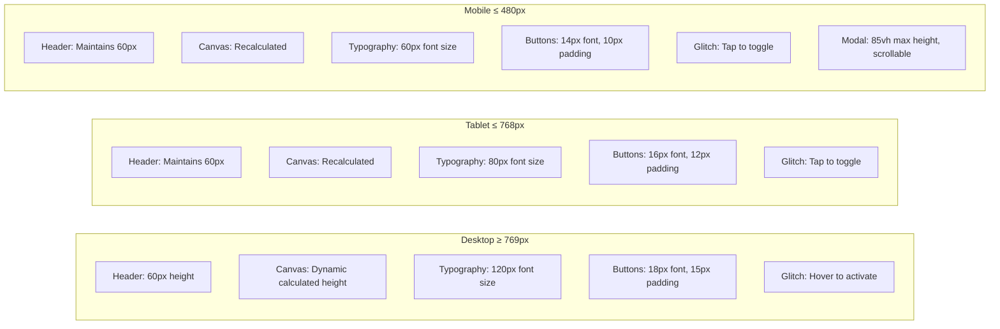

# Noir Mak Website - Wireframe & Interaction Diagram

## Site Architecture & User Flow

```mermaid
graph TD
    %% Main Page Structure
    START[User Visits Site] --> HEADER[Header Section]
    HEADER --> CANVAS[Kinetic Typography Canvas]
    CANVAS --> SOCIAL[Social Media Links]
    SOCIAL --> FOOTER[Footer Section]

    %% Header Components
    HEADER --> LOGO[noir mak - Logo/Title]
    HEADER --> ABOUT_BTN[about - Button]

    %% About Modal Flow
    ABOUT_BTN -->|Click/Tap| MODAL[Bio Modal Overlay]
    MODAL -->|Shows| BIO_CONTENT[Scrollable Bio Text]
    MODAL --> CLOSE_BTN[X Close Button]
    CLOSE_BTN -->|Click/Tap| HEADER
    MODAL -->|Click Outside| HEADER

    %% Canvas Interactions
    CANVAS -->|Contains| KINETIC[Noir Mak Kinetic Text]
    KINETIC -->|Desktop: Hover| GLITCH_ON[Glitch Effects Active]
    KINETIC -->|Mobile: Tap| TOGGLE[Toggle Glitch On/Off]

    GLITCH_ON -->|Triggers| CHROMATIC[Chromatic Aberration RGB Split]
    GLITCH_ON -->|Triggers| BITFLIP[Character Bitflip with Color Flash]
    GLITCH_ON -->|Triggers| JITTER[Micro Jitter Animation]

    CHROMATIC -->|Colors| BLUE[Blue #304ffe]
    CHROMATIC -->|Colors| PINK[Pink #ff1d89]
    BITFLIP -->|Colors| YELLOW[Yellow #ffec00]
    BITFLIP -->|Colors| CHARTREUSE[Chartreuse #bcf804]

    %% Social Links
    SOCIAL --> INSTA[Instagram Icon Button]
    SOCIAL --> YOUTUBE[YouTube Icon Button]
    INSTA -->|Opens| INSTA_LINK[instagram.com/noir_mak]
    YOUTUBE -->|Opens| YT_LINK[youtube.com/@NoirMak]

    %% Footer Navigation
    FOOTER --> WORK_BTN[recent work - Button]
    WORK_BTN -->|Click/Tap| WORK_PAGE[work.html]

    %% Work Page Structure
    WORK_PAGE --> WORK_HEADER[Header with back to home]
    WORK_HEADER --> HOME_BTN[noir mak - Back Button]
    HOME_BTN -->|Click/Tap| START

    WORK_PAGE --> WORK_LIST[Project List]
    WORK_LIST --> PROJ1[stillbecoming]
    WORK_LIST --> PROJ2[Stitched in Code]
    WORK_LIST --> PROJ3[Lumyn]
    WORK_LIST --> PROJ4[Undertones]

    PROJ1 -->|Opens| LINK1[stillbecoming.noirmak.com]
    PROJ2 -->|Opens| LINK2[stitchedincode.noirmak.com]
    PROJ3 -->|Opens| LINK3[lumyn.noirmak.com]
    PROJ4 -->|Opens| LINK4[undertones.noirmak.com]

    %% Styling annotations
    classDef interactive fill:#304ffe,stroke:#fff,stroke-width:2px,color:#fff
    classDef glitch fill:#ff1d89,stroke:#fff,stroke-width:2px,color:#fff
    classDef navigation fill:#bcf804,stroke:#000,stroke-width:2px,color:#000
    classDef content fill:#000,stroke:#fff,stroke-width:1px,color:#fff

    class ABOUT_BTN,WORK_BTN,HOME_BTN,CLOSE_BTN,INSTA,YOUTUBE interactive
    class GLITCH_ON,CHROMATIC,BITFLIP,JITTER,TOGGLE glitch
    class WORK_PAGE,MODAL,WORK_LIST navigation
    class HEADER,CANVAS,FOOTER,KINETIC,BIO_CONTENT content
```

## Layout Structure

```mermaid
graph TB
    subgraph "index.html - Main Page"
        H[Header - Fixed Top<br/>noir mak | about]
        C[Canvas Container<br/>Dynamic Height<br/>Pure Black #000000]
        K[Kinetic Typography<br/>Noir Mak - Wave Animation<br/>Interactive Glitch Effects]
        S[Social Links Section<br/>Instagram | YouTube<br/>Circular SVG Icons]
        F[Footer - Fixed Bottom<br/>recent work]
    end

    subgraph "work.html - Projects Page"
        WH[Header - Fixed Top<br/>noir mak - back to home]
        WC[Work Container<br/>Centered Project List]
        P1[stillbecoming]
        P2[Stitched in Code]
        P3[Lumyn]
        P4[Undertones]
    end

    H --> C
    C --> K
    C --> S
    S --> F

    WH --> WC
    WC --> P1
    WC --> P2
    WC --> P3
    WC --> P4
```

## Responsive Behavior



## Interaction Details

### Kinetic Typography Glitch Effects

| Effect | Trigger | Behavior | Timing |
|--------|---------|----------|--------|
| **Chromatic Aberration** | Hover (desktop) / Tap (mobile) | RGB split - Blue offset left, Pink offset right | 4% probability per frame |
| **Character Bitflip** | Hover (desktop) / Tap (mobile) | Random character substitution from glitch set: #, %, █, ░, ▓, /, \, _, x, * | 3% probability per character |
| **Color Flash** | During bitflip | Random color from palette: Yellow or Chartreuse | 8% probability during bitflip |
| **Micro Jitter** | During any glitch | Small XY position offset with Perlin noise | Continuous during active glitch |
| **Wave Motion** | Always active | Sine wave Y-offset based on X position | Continuous, independent of glitch |

### Canvas Height Calculation

```
Available Height = Window Height
                   - Header Height (60px)
                   - Social Links Height (~80px)
                   - Footer Height (60px)
                   - Buffer (30px)

Minimum Height = 200px
```

### Touch Event Handling

- **Inside Canvas Bounds**: Toggle glitch effects, prevent default
- **Outside Canvas Bounds**: Allow default behavior (enables button clicks)
- **Modal**: Touch scrolling enabled with `-webkit-overflow-scrolling: touch`

## Color Palette

| Element | Color | Hex/RGB |
|---------|-------|---------|
| Background | Pure Black | #000000 |
| Primary Text | White | #FFFFFF |
| Glitch Blue | Electric Blue | #304ffe / rgb(48, 79, 254) |
| Glitch Pink | Hot Pink | #ff1d89 / rgb(255, 29, 137) |
| Glitch Yellow | Bright Yellow | #ffec00 / rgb(255, 236, 0) |
| Glitch Chartreuse | Lime Green | #bcf804 / rgb(188, 248, 4) |

## File Structure

```
/
├── index.html          # Main landing page
├── work.html           # Recent work portfolio page
├── sketch.js           # p5.js kinetic typography with glitch effects
└── wireframe.md        # This documentation
```

## Technical Notes

- **Framework**: p5.js for canvas rendering
- **Font**: Courier New (monospace) for glitch aesthetic
- **Canvas Mode**: WEBGL for potential future 3D effects
- **Responsive Strategy**: Mobile-first with breakpoints at 768px and 480px
- **Performance**: Glitch probabilities tuned for visual impact without overwhelming CPU

## User Journey

1. **Landing** → User sees animated "Noir Mak" kinetic typography with wave motion
2. **Exploration** → User hovers/taps text to activate vibrant glitch effects
3. **About** → User clicks "about" to read bio in modal overlay
4. **Social** → User clicks Instagram or YouTube icons to visit social profiles
5. **Work** → User clicks "recent work" to view project portfolio
6. **Projects** → User clicks project buttons to visit live project sites
7. **Return** → User clicks "noir mak" header to return home

---

**Last Updated**: January 2026
**Created for**: Noir Mak Portfolio Website
**Purpose**: Wireframe documentation for collaboration and design review
